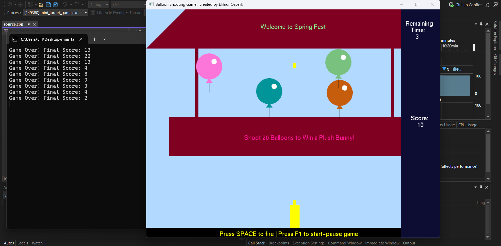
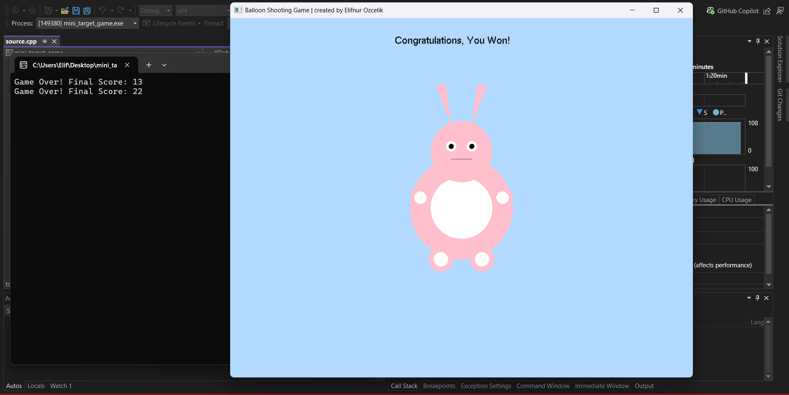

# Balloon Sniper

**Created by: Elifnur Ozcelik**

## Description
This project is developed using OpenGL and the GLUT library. It features a festival-themed shooting game where the player controls a horizontally movable shooter to shoot balloons within a 30-second time limit. The balloons are arranged in two rows that move in opposite directions to increase the challenge.

The goal is to hit at least 20 balloons before time runs out. A maximum of five balloons can appear on the screen at once, keeping the gameplay balanced. If the player reaches the target, a congratulatory message and a plush bunny appear on the screen as a reward.

After each round, the score is printed to the terminal, and all previous scores are preserved for performance tracking.

### Key Features:
- Each balloon is assigned a random color upon creation to enhance visual diversity during gameplay.  
- The balloons are divided into two rows, with one row moving from left to right and the other from right to left, adding motion complexity.
- A maximum of five balloons can appear on the screen simultaneously to maintain a consistent challenge level.
- Players must hit at least 20 balloons within a 30-second countdown to win the game and receive a visual reward.
- After each game session, the player's score is printed to the terminal for immediate feedback.
- All previous scores remain visible in the terminal, enabling players to monitor their progress and compare past performances.

  ## Game Controls:
- **LEFT arrow**: Move the shooter to the left.
- **RIGHT arrow**: Move the shooter to the right.
- **SPACE**: Fire a shot.
- **F1**: Start or pause the game, or start a new game after it ends.

## Screenshots  

Here are some screenshots of the project:

  
*Screenshot showing the player aiming at the balloons.*

  
*Another screenshot showcasing the balloons and game UI.*

  
*The game after the player hits 20 balloons and receives the reward.*

## License  

This project is licensed under the terms of the [LICENSE](LICENSE) file.

## Last Updated  

May 2025
